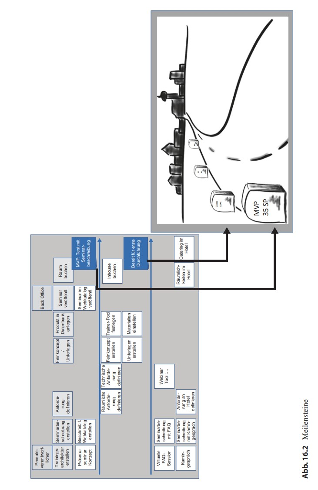

# Informationen Präsentation

## [Software Projektmanagement](index.html)

## Die Roadmap - Zuordnung der To-dos zu den Häppchen"

**Bisher steht im Vordergrund:**
* "Scope": To-dos mit unterschiedlichen Detaillierungsgraden
    * Themen, Features, User Stories
* Sortierung des Product Backlog für zeitliche Abfolge

**Problematisch:**
* Product Backlog: Eindimensionale Liste ohne Zusammenhänge

**Lösung:**
* Roadmap
    * Tool: Story Mapping => Überblick auf das Produkt
---
## Einführung ins Story Mapping
* Story Map: Sicht auf das Produkt in zweidimensionaler Darstellung
    * Horizontal: Reihenfolge der To-dos
    * Vertikal: Alternativen sortiert nach Priorität

---
## Story Map Grundprinzip

---
### Einfügen der Schritte in die Story Map

---
## Story Map Beispiel mit Alternativen

---

### Kleine Problemzonen bei der Story Map
* Reihenfolge der Schritte kann sich situativ ändern / Es gibt von vornherein mehrere Möglichkeiten:
    * Am meisten genutzte Variante visualisieren
    * Alternativen auf den Karten markieren

* Karten mit wiederholenden Schritten:
    * Auf den Karten markieren

* Teilaspekte stellen eher Ergänzungen anstatt Alternativen dar:
    * Darstellung auf andersfarbigen Karten
    * In der Story Map einrücken
---
### Die Planung eines Produktes mit der Story Map

---
### Schritte beim Erstellen der Story Map

---
# Story oder Product Backlog - Wo liegen die Unterschiede?

| Story Map | Product Backlog |
|:---------:|:---------------:|
|Dient dem Überblick über ein Produkt oder ein Prozess| Liste aller anstehenden Arbeiten|
|Ist nicht im User-Story-Format| To-dos werden als User Stories formuliert|
|Dient dem Entdecken des Produktes| Bildet mehr das Ergebnis des Entdeckens ab|
|Dient der Kommunikation mit den Stakeholdern| Kommunikation ist nicht gut unterstützt|
|Hilft beim Entdecken von Lücken| Lücken nur schwer erkennbar|

---
### Die Ergänzung eines Produktes: Story-Writing-Workshop und Story Mapping

Wie sieht die Arbeit bei der Ergänzung eines vorhandenen Produkts aus?

* Schritt 1: Wesentliches Ziel, das in nächster Zeit erreicht werden soll, auswählen.
* Schritt 2: Involvierte Nutzerrollen identifizieren.

* Schritt 3: Wesentliche Schritte der Nutzer identifizieren, um das Ziel zu erreichen.
* Schritt 4: Alternativen notieren, wie diese Schritte umgesetzt werden können.

* Schritt 5: Alternativen nach ihrer Priorität sortieren.
* Schritt 6: Kombination auswählen, mit der jeweils in einer "Welle" oder einem "Häppchen" ein Nutzen gezogen werden kann.
---
### Die Umsetzung der Story Map ins Product Backlog

* Anhand der Story Map gibt es nun einen Überblick über die anstehende Arbeit und über die geplanten "Wellen" oder Releases.

* Zwei Alternativen:
    * Alle Einträge ins Product Backlog übertragen.
    * Jeweils die Einträge pro "Welle" übertragen, bevor die Arbeit an diesen Inhalten beginnt.

### Schätzen der Dauer und Meilensteinplanung

In der Story Map wurden bereits Meilensteinlinien gezogen.
Nun stellen sich folgende Fragen:
* Wie "weit" ist es bis zum nächsten Meilenstein ist?
* Wann kommt man an bzw. wird man fertig?

---

* Die "Strecke" ist bereits bekannt durch die Story Map.
* Es muss die "Entfernung" (Komplexität) der anstehenden Arbeiten auf der Strecke ermittelt werden.
* Zudem wird die durchschnittliche Geschwindigkeit benötigt.

Mit Hilfe dieser Informationen kann der Ankunftszeitpunkt abgeschätzt werden.

---
## Schätzen der Komplexität

* Man muss sich nicht auf Stunden oder Tage festlegen.
* Es ist unerheblich, wer am Ende ein To-do umsetzt.

* Es wird relativ geschätzt und verschiedene To-dos im Vergleich betrachtet:
    * Welches ist komplexer, welches weniger komplex?

**Erinnerung:**
* Relatives Schätzen mit T-Shirt-Größen
* Schätzen mit Story Points
* Planning Poker
---
# Magic Estimation

* Verwendung von Story Points
* Schätzung erfolgt schweigend durch Gruppieren der Anforderungen
    * Damit ist der Schätzvorgang schneller
    * Eignet sich vor allem bei größeren Mengen an zu schätzenden Anforderungen

**Schritt 1 - Auslegen und Informieren:**
* Die zu schätzenden Anforderungen werden auf einem Tisch ausgebreitet.

* Die Skala wie bei den Planning Poker-Karten wird auf einer Wand oder auf den Boden markiert.
---

**Schritt 2 - Erstes Einordnen:**
* Das Team sieht sich gemeinsam alle Anforderungen (auf Karten notiert) schweigend an.

* Jeder kann sich Anforderungen nehmen und nach seiner Einschätzung der Story Points in der entsprechenden Spalte ablegen.

**Schritt 3 - Überblick und Korrekturen:**
* Wenn alle Anforderungen einsortiert sind, verschafft sich das Team einen Überblick über die getroffenen Einordnungen.

* Jeder kann nun nach Karten greifen und sie anders als bisher einsortieren.

* Am Ende wird der geschätzte Komplexitätsgrad auf der jeweiligen Karte notiert.
---
Die folgende Abbildung zeigt schematisch die Skala mit den einsortierten Stories.

---
### Abschätzen der Durchschnittsgeschwindigkeit

Was ist die Durchschnittsgeschwindigkeit eines Teams?
* Verwendung der Anzahl der Story Points, die das Team in einem bestimmten Zeitrahmen üblicherweise schafft.
* In **Scrum** => Velocity des Teams
* In **Kanban** => Messung der Durchlaufzeit

### Messung der Durchschnittsgeschwindigkeit in Scrum oder Kanban

**Velocity:** Berechnung aus der durchschnittlichen Anzahl an Story Points, die ein Team pro Sprint schafft.

**Durchlaufzeit:** Durchlaufzeit = WIP / Durchsatz

**Work in Progress (WIP):** Arbeitsmenge im System (Anzahl Tickets)

**Durchsatz:** Angabe darüber, wie viele Arbeitseinheiten in einem bestimmten Zeitraum fertig werden.

---

**Das Team hat eine bekannte Durchschnittsgeschwindigkeit**
* Bei Teams die bereits in ähnlichen Projekten zusammengearbeitet haben, gibt es Erfahrungswerte zur Durchschnittsgeschwindigkeit.
* Voraussichtliche Ankunfszeit ist abschätzbar.

**Die Durchschnittsgeschwindigkeit des Teams ist nicht bekannt**
* Traditionelle Schätzmethode für die Ermittlung des Aufwands benutzen
* Erfahrungswerte sammeln und Durchschnittsgeschwindigkeit ermitteln
* Aufwand mit Hilfe der bisherigen relativen Schätzung hochrechnen

**Was fehlt noch bei der Abschätzung des Zeitbedarfs?**
* Eventuelle Nachbesserungen, Tests, Meetings, Statusberichte
    * Ist nicht als Anforderung in der Story Map erfasst.
    * Muss zum geschätzten Aufwand zur Umsetzung der Anforderungen hinzuaddiert werden.
---
# Agile Projektplanung
* Erarbeitung von Ergebnissen in Workshops
* Bei der Planung zählt nicht nur das Ergebnis, sondern auch der Meinungaustausch

* Häufiges Feedback ist wichtig
* Feedback erfolgt möglichst nicht auf der Basis von abstrakten Konzepten, sondern auf der Basis von einsatzfähigen Ergebnissen
---
### Einführung in Kanban

Kanban kann eingesetzt werden:
* Als Personal Kanban im Selbstmanagement
* Als Kanban-System in Teams und für Projekte
* Übergreifend auf Portfolioeben im Unternehmen

**Kanban-Methode:**
* Sechs Praktiken und vier fundamentale Prinzipien

**Kanban-System:**
* Pull-System, das durch die Limitierung der Anzahl Signalkarten (Kanbans) implementiert wird.

**Personal Kanban:**
* Anwendung von Kanban auf Einzelpersonen oder kleine Teams, um die Arbeitsmenge zu steuern.

**Wissensarbeit:**
* Arbeit, die primär das Nutzen und Weiterentwickeln von Wissen umfasst.
---
**Kanban eignet sich immer dann besonders, wenn**
* das Umfeld und die Arbeit von Unterbrechungen geprägt sind.
* die Konzentration auf nur ein Projekt nicht gegeben ist.
* die Arbeit in festen Iterationen nicht möglich ist.

**Arbeitstyp:**
* Bestimmte Art von Arbeitseinheiten
* Kennzeichnung durch bestimmte Abfolge von Bearbeitungsschritten

**Ticket:**
* Visuelle Abbildung einer Arbeitseinheit auf dem Kanban-Board

**Serviceklasse:**
* Zuordnung von Tickets
* Einteilung erfolgt in Abhängigkeit von Risiken (Zeit, Kosten)

**Work-in-Progress(WIP):**
* Arbeit, die begonnen hat, aber noch nicht fertiggestellt ist.

**WIP-Limit:**
* Zahl im Spaltenkopf, die die maximale Anzahl von Tickets in dieser Spalte angibt.
---
**Praktik 1: Mach Arbeit sichtbar**
* Die Arbeitstypen im System identifizieren
* Auf dem Kanban-Board die Prozessschritte festlegen
* Wie sollen die Tickets aussehen, die die Arbeit im System repräsentieren?

**Praktik 2: Limitiere den Work in Progress**
* Mantra in Kanban: "Stop starting, start finishing"
* Einführung von künstlichen Begrenzungen:
    * In Scrum: Timebox der Iterationen
    * In Kanban: WIP-Limit

**Praktik 3: Manage Flow**
* Woher kommen die Arbeitsaufträge?
* Wie wird der Zufuss an Arbeit ins System gesteuert?
* Wie werden Releases/Lieferungen geplant?
* Wie wird mit Arbeit aus unterschiedlichen Serviceklassen umgegangen?
* Gibt es zwischendurch Wartezeiten? Übergaben?

---
**Praktik 4: Mach Prozessregeln explizit**
* Wann ist "fertig" wirklich "fertig"?
* Wann kann ein Ticket von einem Prozesschritt zu einem anderen weiterwandern?
* Was muss qualitativ in der Arbeit passiert sein?

**Praktik 5: Implementiere (häufige) Feedbackmechanismen**
* Welche Feedbackmöglichkeiten und Meetings gibt es?
* Wie oft sollen sie stattfinden?
* Mit welchen Teilnehmern und welchem Ziel?

**Praktik 6: Führe gemeinschaftlich Verbesserungen durch**

### Kanban Flight Level
* Kanban kann von der persönlichen Ebene bis zur Ebene des Unternehmens eingesetzt werden:
    * Flight Level 1: Operative Ebene mit einem Projekt oder Team
    * Flight Level 2: Koordinierung der Zusammenarbeit mehrerer Teams
    * Flight Level 3: Strategisches Portfoliomanagement