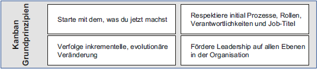

# Informationen Präsentation

# Kapitel 18 & 19
Seiten: 211 - 268

### Kanban - Überblick

**Kanban:**

- kommt ursprünglich aus der Produktion
- auch in der Wissensarbeit eingesetzt
- Arbeitsmenge und den Arbeitsfluss sichtbar machen

- beruht auf vier Grundprinzipien:
  * Starte mit dem, was du jetzt machst.
  * Verfolge inkrementelle, evolutionäre Veränderung.
  * Respektiere initial Prozesse, Rollen, Verantwortlichkeiten und Jobtitel.
  * Fördere Leadership auf allen Ebenen in der Organisation.

- wie gehören Werte, Praktiken und Grundprinzipien zusammen?
- im Fokus steht nicht nur das System, sondern im Besonderen die Arbeitskultur

**Was Kanban kann und zulässt:**

- keine feste Taktung, flexibel Veränderbar
- Abbildung von unterschiedlichen Aufgaben und Projekten
- Der Fokus liegt auf dem Fluss "Stop starting, start finishing"
- Context Switching wird reduziert "Rüstzeiten auch bei Menschen"
- Verschwendung reduzieren
- Feedback und kontinuierliche Verbesserung

### Kanban - In der Produktion / In der Wissenschaft

- im TPS (Toyota Production System) eingesetzt
- Nachfrage und Kapazität steuern
- im alltäglichen Leben wiederzufinden:
  * Kaffee bestellen und bezahlen
  * Ticket (Signalkarte) mit Bestellung an den Barista gegeben
  * es wird das produziert was gebraucht wird, nicht mehr 

- Wichtige Regeln aus der Produktion:
  * ein nachgelagerter Prozess, sagt dem Vorgelagerten, was benötigt wird
  * keine Produktion auf Vorrat
  * keine Herstellung ohne Signal

**Was sind typische Themen in der Wissenschaft?**

- Überlastung der Teams
- anfallende Arbeiten nicht transparent
- Prozesse dauern länger als erwartet
- zu viele parallele Arbeiten
- keine Aufrechterhaltung des Fokus (switchen der Arbeiten)
- keine Definition der Prioritäten

**Kanban-Praktiken:**

### Die Werte, Grundprinzipien und Praktiken von Kanban

- Erklärung der Präsentationsthemen anhand eines Kanban-Boards visualisieren
- Verknüpfung der Werte mit Praktiken oder Grundprinzipien

#### **Transparenz** (Wert) & **"Macht Arbeit sichtbar"** (Praktik)
- Visualisierung
- Whiteboards
- Festlegen der Prozesschritte, Erste?, Letzte?, Übergänge?
- Wartezeiten sichtbar, wenn die Tickets bewegt werden
- Überlastung wird erkennbar → ganz viele Tickets in einer Spalte
- Überlastungen erkennbar
- Auf einen Blick das System erfassen

**Deepen the knowledge:** "Macht Arbeit sichtbar"
- Spalten → Bearbeitungsschritte
- Pull prinzip im Fluss der Arbeit
- Weitere Unterteilung von "in Arbeit" in → Entwurf, Abnahme, Umsetzung, Einsatz
- Unterspalten
- Fertig als Output-Queue, was passiert danach?
- Übergang zum Kunden?
- Backlog aufteilen, um zu wissen woher eine Aufgabe kommt
- Aufräumen des Boards

#### **Balance** (Wert) & **"Limitiere den Work in Progress"** (Praktik)
- Wie viel Parallele Verarbeitung?
- Immer mehr Themen rutschen in die Vorstellung und werden nicht abgearbeitet → es geht ums fertig werden und nicht ums Anfangen von Aufgaben
- Spalten limitieren, damit der Flaschenhals der Bearbeitung gemeinsam angegangen werden kann
- Nur fertige Arbeit bietet einen Mehrwert
- Ausbalancieren von Arbeitslast und Kapazität
- Weniger Multitasking → mehr Fokus → mehr Qualität
- Last von Kollegen auch limitieren

**Deepen the knowledge:** "Limitiere den Work in Progress"
- WIP (Work in Progess) → WIP-Limits
- Pull-System zum Nutzen freier Kapazitäten
- Probleme und Engpässe werden sichtbar
- Multitasking wird beschränkt

#### **Kooperation** (Wert) & **"Führe gemeinschaftlich Verbesserung durch"** (Praktik)
- Innerhalb des Teams
- Auch über die Teamgrenzen hinweg
- Betrifft interne oder externe Kunden
- Aus zwei Teams mit zwei Boards ein Team mit einem Board machen
- Mehr Schritte darstellen und Zwischenschritte werden sichtbar

#### **Kundenfokus** (Wert) & **"Manage den Arbeitsfluss"** (Praktik - Teil1)
- Wissen Sie, was Sie liefern an wen und warum → Mike Burrows
- Wer sind Kunden
- Was sind Bedürfnisse?
- Anforderungen an etwas was noch nicht besteht, bezieht sich immer auf etwas Abstraktes
- Anhand erster konkreter Ergebnisse die Bedürfnisse beschreiben und weiterentwickeln
- "Was wissen wir noch nicht?“
- Zu viele Ideen, alle im to-do kommen aber nie dran
- Umsetzung der Ideen ist ein Wettbewerb
- Wem nutzt die Umsetzung?
- Wessen Bedürfnisse werden abgedeckt?
- Die Aufnahme ist ein Commitment, vielleicht
- Kundenfokus → bringt Innovation

#### **Arbeitsfluss** & **"Manage Flow im System"** (Praktik - Teil2)
- Beginn beim Ist-Zustand
- Verbesserung aufgrund der gewonnenen Erfahrungen und Einsichten
- Kanban ist nicht statisch
- Individuelle Anpassung, Limits, Spalten, Aufgaben
- Keinen Idealzustand anstreben
- Keine Veränderung über längere Zeit? Wird das system noch genutzt?
- Kanban ist dann am effizientesten, wenn es übergreifend genutzt wird und nicht nur für das persönliche Management

**Deepen the knowledge:** "Manage den Arbeitsfluss"
- Zufluss steuern:
  * Wer stellt Arbeitsaufträge?
  * Wie wird priorisiert?
  * Wie funktioniert die Zuweisung?
  * Replenishment-Meetings um Bearbeitungsprioritäten festzulegen
- Abfluss steuern:
  * Was passiert mit fertigen Aufgaben?
  * Release, übergabe an den Kunden
  * Wann ist "fertig" wirklich "fertig"?
  * Definitionen, Regeln, Abgrenzungen
- Fluss im System steuern:
  * Standard
  * Beschleunigt
  * Festes Lieferdatum
  * Unbestimmbare Kosten

#### **Leadership** (Wert) & **"Fördere Leadership auf allen Ebenen der Organisation"** (Grundprinzip)
- Fähigkeit zu motivieren und zu Überzeugen
- Leadership ist ungleich Management
- Leadership ist Macht durch Akzeptanz, Identifikation und Motivation
- Management ist Macht die auf Hierarchie und Kompetenz zurückgeführt wird
- Nicht Teil des Managements, trotzdem Leader
- Change-Management-Ansatz → gemeinsame Verbesserungen
- Dafür ist Leadership auf allen Ebenen der Organisation benötigt

Retrospektive als Basis für Verbesserungen (Gemeinsam besser werden):
- Reflexion des Arbeitsumfeldes
- Geschützter Raum, Kultur der Offenheit, benötigt Zeit
- nicht nur beim Versagen oder einem Fehlschlag, regelmäßig
- soll keine Herausforderung werden

### **Verständnis** (Wert) & **"Starte mit dem, was du jetzt machst"** (Grundprinzip)
- Der ist-Zustand bildet den Anfang
- Keinen Wunschzustand darstellen
- Verständnis für Stärken und Schwächen im IST
- „Starte mit dem, was du jetzt machst und verstehe“ – Kombinieren
- Verstehe den Zweck des Systems und wie es dem Kd dient
- Macht es Kd unzufrieden und frustriert Mitarbeiter?
- Wie sieht die Richtung der Veränderung aus?
- In dem Wissen was erreicht werden soll und welchem zweck es dient, liegt die Macht

### **Vereinbarung** (Wert) & **"Verfolge inkrementelle und evolutionäre Veränderung"** (Grundprinzip)
- Verfolgen! Nicht anwenden
- Ist ein dauernder Prozess und keine Einmalaktion
- Geht immer vom Ist-zustand aus
- Neuer zustand kann zu IST werden
- Erproben, Erfahren -> daraus schlüsse ziehen
- Ergebnisoffen
- Nach jedem Schritt neues Verständnis aufbauen
- ANPASSUNGSFÄHIGKEIT und die Fähigkeit zur Veränderung
- Kleine Schritte um bleibende Schäden zu vermeiden

### **Respekt** (Wert)
- Laufend von Veränderungen gesprochen
- Der Ausgangspunkt bleibt jedoch der IST-Zustand
- Zeichen von Respekt an der derzeitigen Situation zu arbeiten und diese weiterzuentwickeln anstatt alles über Board zu werfen
- Respekt heißt auch sich auf Augenhöhe zu begegnen, bei gemeinsamer Arbeit, Diskussionen und Veränderungen

