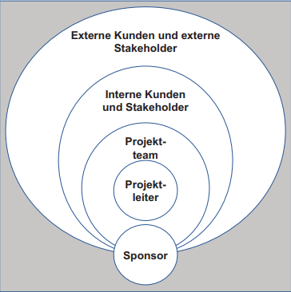
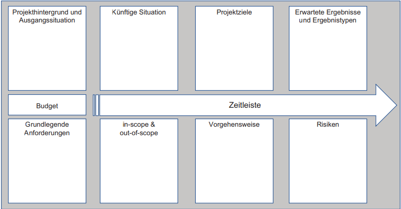
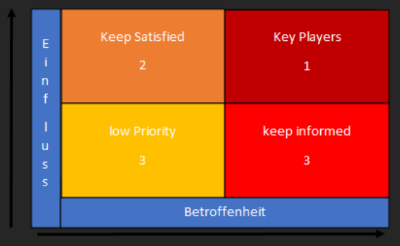
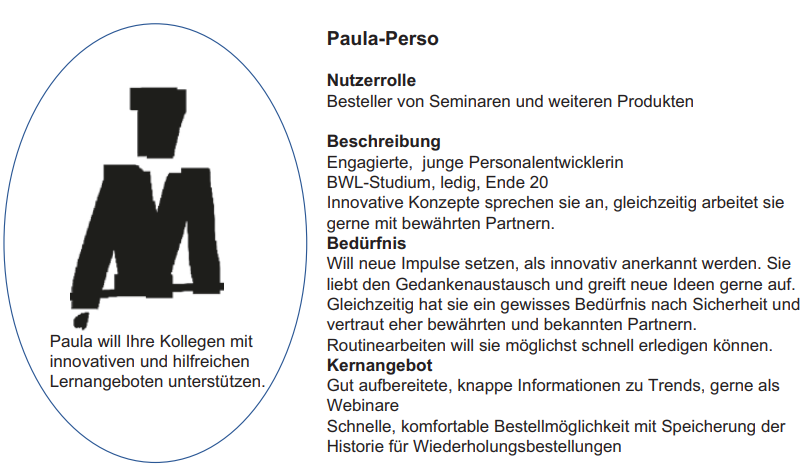

class: center, middle

## [Software Engineering](../../praesentationen.html)

# Der rote Faden

**Stationen**
* Vision
* Project Charter
* Stakeholder
* Product Backlog
* Risikomanagement
* Minimum Viable Product
* Story Map

---
### **Der rote Faden**
***
## Die Vision 

- Zielrichtung
- Projektleiter und Sponsor -> Verständnis

Beantwortet die Fragen: 

* Worum geht es?
* Was ist das Ziel?
* Was wollen wir erreichen?
---
### **Der rote Faden**
***
## Project Charter

* Rahmenbedingungen
* Projektleiter erstellt
* Sponsor genehmigt
* Stakeholder erhalten

---
### **Der rote Faden**
***
## Stakeholder

* Alle Beteiligte an dem Projekt        
    * Sponsor
    * Projektleiter 
    * Teammitglieder
    * etc.

* wichtig für das Product Backlog (Anforderungen)

---
### **Der rote Faden**
***
## Product Backlog

* Alle Arbeit die zu leisten ist
    * Anforderungen
    * Know-How
    * Dokumentationsarbeiten
* Priorisiert - wichtigsten oben
* unterschiedlich detailliert
* Backlog lebt

---
### **Der rote Faden**
***
## Risikomanagement

* fördernd (positiv)
    * Chancen
* behindernd (negativ)
    * Risiken
* notwendige Dinge -> Product Backlog

---
### **Der rote Faden**
***
## Minimum Viable Product (MVP)

* Prototyp
* Feedback von Stakeholdern
* z.B. App 

## Minimum Marketable Feature (MMF)

* Kundenanforderungen
* Nutzen

---
### **Der rote Faden**
***
## Die Roadmap - Story Map

* Übersicht über Wellen Releases
* Feedback von Stakeholdern
* Welle = Chance auf Feedback
* nicht zu lange in eine Richtung
---

### **Der rote Faden**
***
## Ergebnis der Planung

* Auftraggeber/Projektleiter gleiches Verständnis
* Projekt genehmigt
* Stakeholder + Anforderungen sind klar
* Product Backlog erstellt
* Ungefähre Reihenfolge der Arbeit (Road Map)

---

# Die Vision
***
**Entwicklung und Einsatz**

* Grundidee des Projektes erklären
* Gruppen aufteilen
* Elevator Pitch(Kurzpräsentation)/ Product Box (Produktverpackung)

**Vorgang**
* schreiben der Vision
* Vorstellen
* besten Teile zusammenfassen

**Ohne Gruppen** -> Ausarbeitung durch Projektleiter -> Sponsor vorstellen

**Einsatz**
* Sichtbar für alle
---
### **Die Vision**
***
## Elevator Pitch

* Kurzpräsentation (2 Minuten)
* Wichtige Punkte:
    * Für wen ?
    * Was ist das Bedürfnis?
    * Was ist das Produkt?
    * Warum sollte man es kaufen
    * Was macht das Produkt anders
---
### **Die Vision**
***
**Die eigene elevator Speech erstellen**

* In den Schuhen des Kunden laufen
* Wichtigsten Punkte 
* authentisch bleiben
* Text können egal welcher Gesprächspartner
* Vorsichtig mit Fachsprache
* keine Last-Minute-Änderungen im Gespräch
* Begeisterung zeigen

**Einsatzmöglichkeiten**
* Treffen mit Kollegen 
* Treffen mit Führungskräften 
* Treffen mit anderen Projektleitern 
* Netzwerktreffen 
* Telefonate z.B. mit Stakeholdern 
---

### **Die Vision**
***
## Design the Product Box

* Produkt attraktiv machen
* Vorderseite: Logo, Name des Projektes, Schlüsselbotschaften
* Rückseite: die wichtigsten Kerneigenschaften.
---
# Project Charter (Projektauftrag)

* Vision -> Richtung
* Charter -> Genehmigung
* Vision ist Teil der Genehmigung
* Charter ist erforderlich
---
### **Projekt Charter**
***
## Nutzen

* Ein Projekt für ein Ziel (effizient)
* Umfangreicher als die Vision

**Inhalt**

* Warum dieses Projekt?
* Projektziele?
* Inhalt und Umfang
* Stakeholder?
* Wo und mit welchen Ressourcen?
* Wann? (Start/Ende)
* Wie? (Umsetzung)
* Risiken? (Chancen/Bedrohungen)
---
### **Projekt Charter**
***
**Darstellung**
* Dokument
* Grafische Zusammenfassung

## Dokument

* In Word
* Gestaltung vorgegeben (Lesbarkeit)
---
### **Projekt Charter**
***
## Grafische Darstellung

* Project Canvas
    * Informationen auf einer Seite
    * keine Standarts
    * PowerPoint

---
### **Projekt Charter**
***
## Projektziele

* Messbar formuliert (SMART)
    - S – Spezifsch M – Messbar A – Ansprechend, motivierend R – Realistisch T – Terminiert 
* Im Einflussbereich und Rahmen

**Besprechung mit Sponsor**
* Gleiches Verständnis über:
    * Grenzen
    * Projektziel
    * Stakeholder
    * Risiken

**Genehmigung** -> "richtiges" Projekt
---
### **Projekt Charter**
***
## Team Charter

* für die Dauer des Projektes
* unterschiedliche Lebenszeiten 

Eventuel kommen die Projekte zu den Teams

**Umfang**
* Zweck des Teams
* Rollen im Team
* Werte des Teams
* Üblichen Kernarbeitszeiten
* Spielregeln z.B. Verhalten in Meetings
* lebendiges Dokument
* In Meetings ausstellen
---

# Stakeholder

* Alle Betroffenen
    * Stake im Projekt (Einsatz,Anteil, etc.)

**Stakeholder identifizieren**

* Stakeholder-Analyse
* Personas
---
### **Stakeholder**
***
## Stakeholder-Analyse

1. Liste über Stakeholder-Gruppen
2. Einfluss und Betroffenheit kennen (Stakeholder-Portfolio)
3. Strategie zum Einbinden dieser entwickeln

**Stakeholder Gruppen**

* Wer kann bei der Gestaltung helfen?
* Anwender?
* Schnittstellen? (Betroffene)
* Mitspracherecht?
* Betriebsrat?
* Wer könnte Feedback geben ?
* Stakeholder außerhalb ?
* usw.

Gruppen: Kunden, Externe, Kollegen
---
### **Stakeholder**
***
## Stakeholder-Analyse

**Einfluss und Betroffenheit**
* Einfluss und Betroffenheit herausfinden (Matrix)

---
### **Stakeholder**
***
## Stakeholder-Analyse

**Kommunikationsstrategie zur Einbindung**

1. Stakeholder als Partner
    * Einbinden in Kommunikation und Entscheidungsprozess
    * Aufwand sehr hoch (Kunden, Sponsoren)
2. Stakeholder im Gespräch
    * Regelmäßig informiert
    * Bedenken/Meinungen umgesetzt
3. informierte Stakeholder
    * Lediglich informiert
---

### **Stakeholder**
***
## Stakeholder-Analyse
**Stakeholder Register**

* Liste über Informationen (zugänglich)

**Inhalt**
* Name
* Rolle
* Abteilung und Kontaktdaten
* Anforderungen
* Auswirkung auf Stakeholder
* Einfluss von Stakeholder
* Kommunikationsstrategie

---
### **Stakeholder**
***
**Stakeholder identifizieren**

* Stakeholder-Analyse
* **Personas**
---
### **Stakeholder**
***
## Personas

- Eignet sich für Nutzer
- Gruppen bilden
- Namen vergeben
- Sammlungen von Personas
---
### **Stakeholder**
***
## Personas
* verschiedene Nutzer-Gruppen
* Nutzen bei Benutzerschnittstellen (Microsoft)

**Erstellung**
- im Team (Verständnis)
* Typische Nutzer
* Überschneidungen ?
* Namen geben 
* In deren Schuhen laufen
* Personas bei Product backlog und To-Dos nutzen
* aktualisieren nach Feedback
---
### **Stakeholder**
***
## Personas
**Beschreibung der Personas**
* Name (Peter der PO(Product Owner))
* Grundanforderung
* Beschreibung als Nutzer
* Motivation für Nutzung
* Ideale Features für diese Persona

---

# Kunden/Nutzer besser verstehen
**JTBD-Framework (Jobs-to-be-done)**
* Pain-Gain-Map
    * Gains
        * Was möchte die Person?
        * Wie definiert sie Erfolg?
        * Was kann das Produkt bieten?
        * Wovon profitiert sie?
    * Pains
        * Wofür ist er verantwortlich?
        * Wovor hat er Angst?
        * Welche Hindernisse kennt er?