class: center, middle

## [Software Projektmanagement](../../praesentationen.html)

#### Kapitel 1

# Einleitung

Max Mustermann

---
### Inhalt
***

* Begriffsklärungen Projektmanagement
  * Methode
  * Projekt
  * Projektmanagement
  * "klassisches" Projektmanagement
  * "agiles" Projektmanagement
  * Projektmanager/Projektleiter
* Themengruppen Projektmanagement nach ISO 21500
* Projektlebenszyklus
* Klassisches (Plangetriebenes) Projektmanagement
* Agiles Projektmanagement
  * Begriffe
  * Scrum
  * Kanban

---
### Begriffsklärungen
***

**Projekt:**
* zeitlich begrenztes Vorhaben (definierter Anfang und Ende)
* Erzeugung eines einmaligen Ergebnisses
* ist kein Prozess mit definierten Auslöser und Ergebnis

**Projektmanagement:**
* umfasst Führungsaufgaben, -organisation, -techniken, -mittel zur erfolgreichen Abwicklung eines Projektes

---

### Begriffsklärungen
***

**Methode:**
* Beschreibung eines planmäßigen Vorgehens um Ziele zu erreichen
* Art des Handelns

**Projektmanager/Projektleiter:**
* mit der Führung des Teams betraute Person
* für Erreichung der Ziele des Projektes verantwortlich
* Aufgaben:
  * Mitgliedschaft und Rollen unter Führung des Projektleiters
  * Verantwortung für das Team und das Ergebnis
  * Wissen und Fähigkeiten

---
### Begriffsklärungen
***

**"Klassisches" und "Agiles" Projektmanagement:**

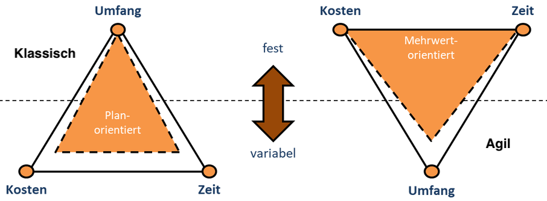

---

### Themengruppen Projektmanagement
***

**Themengruppen:** Themenbereiche, die spezifisches Wissen erfordern und durch Prozesse, Ergebnisse sowie verwendete Werkzeuge und Methoden charakterisiert werden.

**Themengruppen des Projektmanagements nach ISO 21500:**
* **Integration:** Vorgehensweise zur ganzheitlichen Projektintegration.
* **Stakeholder:** Betroffene und Interessenten am Projekt.
* **Scope:** Projektinhalt und -umfang.
* **Resource:** Potenzielle Teammitglieder und benötigtes Know-how.
* **Time:** Dauer der Projektabdeckung.
* **Cost:** Kosten für Projektabdeckung.
* **Risk:** Projektbezogene Risiken (Chancen und Bedrohungen).
* **Quality:** Zu beachtende Qualitätsstandards und Prüfverfahren.
* **Procurement:** Notwendige Beschaffungen für das Projekt.
* **Communication:** Kommunikationsmethoden und -rhythmus im Team.

---

### Projektlebenszyklus
***

Der Projektlebenszyklus ist die __Abfolge der Phasen__, die ein Projekt vom __Aufsetzen__ (Initiieren) bis zum __Abschluss__ durchläuft.

* Erarbeitung des Projektergebnisses läuft in Phasen ab
* Phasen je nach Branche oder Umfeld unterschiedlich
* Allgemeine Ausdrücke für Phasen:
    * Analyse
    * Design
    * Herstellung/Umsetzung
    * Test
    * Lieferung

---

### Projektlebenszyklus
***

**Phasenmodelle:**
* Project Management Institute beschreibt __vier verschiedene Phasenmodelle__:
    * Predictive life cylce ("klassischer" Ansatz)
    * Iterativer Lebenszyklus
    * Inkrementeller Lebenszyklus
    * Agiler Lebenszyklus (inkrementell und iterativ)

---

### Projektlebenszyklus
***

* __Iteration:__ die in Schleifen erfolgende Ausarbeitung eines Ergebnisses 
* __Inkrement:__ ein Ergebnis, das immer weiter ergänzt wird

**Vorgehensweisen:**

---

### Projektlebenszyklus
***

**Anwendung der Lebenszyklen:**

---

### Klassisches (Plangetriebenes) Projektmanagement
***

**Schritte der klassichen Planung eines Projektes:**
1. Projektteam zusammenstellen
2. Scope definieren
  * Inhalt, Umfang
3. benötigte Ressourcen schätzen
  * Time, Cost 
4. Planung in weiteren Themengruppen
5. Projektmanagementplan
6. Projektplan
  * Baselines
7. Change Requests
  * spätere Änderungen der Planung

---

### Agiles Projektmanagement
***

__Agiles Projektmanagement:__ 
* ermöglicht flexibles Arbeiten 
* hohe Team-Beteiligung 
* akzeptiert variable Qualitätsstandards, Zeit- und Kostenrahmen
* Scrum und Kanban wichtige Vertreter

---

### Agiles Projektmanagement - Scrum
***

**Scrum:**
* agiles Vorgehensmodell im Projektmanagement

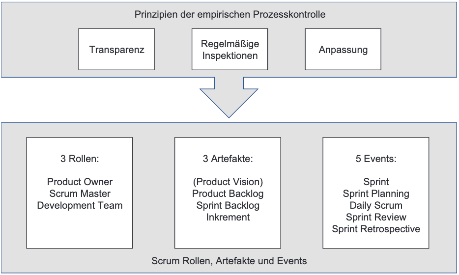

---

### Agiles Projektmanagement - Scrum
***

**Sprint:**

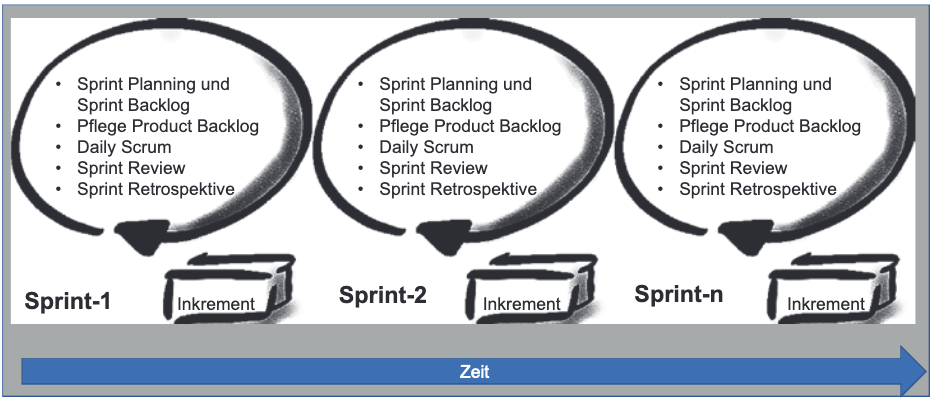

---

### Agiles Projektmanagement - Scrum
***

**Scrum-Artefakte und Events:**

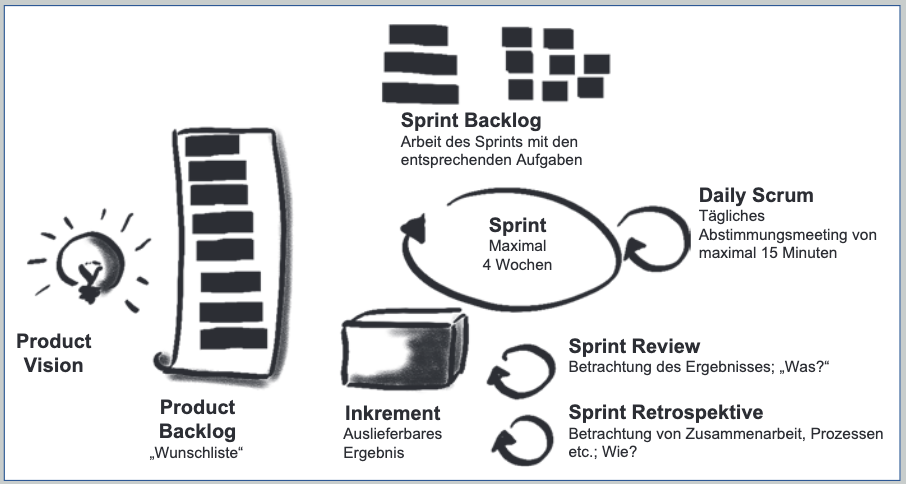

---

### Agiles Projektmanagement - Scrum
***

**Scrum-Rollen:**
* **Product Owner:** hat zentrale Verantwortung für Produkt (Erfolg, Profitabilität)
* **Scrum Master:** kümmert sich um Hindernisse und Probleme sowie das Management des Prozesses
* **Development Team:** organisiert sich eigenständig und erstellt die Produktinkremente
* **Scrum Team:** besteht aus Product Owner, Scrum Master und Development Team
  
---
class: center, middle

## [Software Engineering](../../praesentationen.html)

# Der rote Faden

**Stationen**
* Vision
* Project Charter
* Stakeholder
* Product Backlog
* Risikomanagement
* Minimum Viable Product
* Story Map

---
### **Der rote Faden**
***
## Die Vision 

- Zielrichtung
- Projektleiter und Sponsor -> Verständnis

Beantwortet die Fragen: 

* Worum geht es?
* Was ist das Ziel?
* Was wollen wir erreichen?
---
### **Der rote Faden**
***
## Project Charter

* Rahmenbedingungen
* Projektleiter erstellt
* Sponsor genehmigt
* Stakeholder erhalten

Beantwortung der W-Fragen:

* Warum wird das Projekt gemacht?  
* Was sind die messbaren Projektziele?  
* Was sind Inhalt und Umfang?  
* Wer ist beteiligt und betroffen (Stakeholder)?  
* Wo und mit welchen Ressourcen wird das Projekt durchgeführt?  
* Wann und in welchem Zeitrahmen soll das Projekt stattfinden?  
* Wie soll das Projekt umgesetzt werden? 

---
### **Der rote Faden**
***
## Stakeholder

* Alle Beteiligte an dem Projekt
    * Sponsor
    * Projektleiter
    * Teammitglieder
    * etc.

* wichtig für das Product Backlog (Anforderungen)

---
### **Der rote Faden**
***
## Product backlog

* Alle Arbeit die zu leisten ist
    * Anforderungen
    * Know-How
    * Dokumentationsarbeiten
* Priorisiert - wichtigsten oben
* unterschiedlich detailliert
* Backlog lebt

---
### **Der rote Faden**
***
## Risikomanagement

* fördernd (positiv)
    * Chancen
* behindernd (negativ)
    * Risiken
* notwendige Dinge -> Product backlog

---
### **Der rote Faden**
***
## Minimum Viable Product (MVP)

* Prototyp
* Feedback von Stakeholdern
* z.B. App 

## Minimum Viable Feature (MMF)

* Kundenanforderungen
* Nutzen

---
### **Der rote Faden**
***
## Die Roadmap - Story Map

* Übersicht über Wellen Releases
* Feedback von Stakeholdern
* Welle = Chance auf Feedback
* nicht zu lange in eine Richtung

---
### **Der rote Faden**
***
## Ergebnis der Planung

* Auftraggeber/Projektleiter gleiches Verständnis
* Projekt genehmigt
* Stakeholder + Anforderungen sind klar
* Product Backlog erstellt
* Ungefähre Reihenfolge der Arbeit (Road Map)

---

# Die Vision
***
**Entwicklung und Einsatz**

* Grundidee des Projektes erklären
* Gruppen aufteilen
* Elevator Pitch(Kurzpräsentation)/ Product Box (Produktverpackung)

**Vorgang**
* schreiben der Vision
* Vorstellen
* besten Teile zusammenfassen

**Ohne Gruppen** -> Ausarbeitung durch Projektleiter -> Sponsor vorstellen

**Einsatz**
* Sichtbar für alle
---
### **Die Vision**
***
## Elevator Pitch

* Kurzpräsentation (2 Minuten)
* Wichtige Punkte:
    * Für wen ?
    * Was ist das Bedürfnis?
    * Was ist das Produkt?
    * Warum sollte man es kaufen
    * Was macht das Produkt anders
---
### **Die Vision**
***
**Die eigene elevator Speech erstellen**

* In den Schuhen des Kunden laufen
* Wichtigsten Punkte 
* authentisch bleiben
* Text können egal welcher Gesprächspartner
* Vorsichtig mit Fachsprache
* keine Last-Minute-Änderungen im Gespräch
* Begeiosterung zeigen

**Einsatzmöglichkeiten**
* Treffen mit Kollegen 
* Treffen mit Führungskräften 
* Treffen mit anderen Projektleitern 
* Netzwerktreffen 
* Telefonate z.B. mit Stakeholdern 
---

### **Die Vision**
***
## Design the Product Box

* Produkt attraktiv machen
* Vorderseite: Logo, Name des Projektes, Schlüsselbotschaften
* Rückseite: die wichtigsten Kerneigenschaften.
---
# Project Charter (Projektauftrag)

* Vision -> Richtung
* Charter -> Genehmigung
* Vision ist Teil der Genehmigung
* Charter ist erforderlich
---
### **Projekt Charter**
***
## Nutzen

* Ein Projekt für ein Ziel (effizient)
* Umfangreicher als die Vision

**Inhalt**

* Warum dieses Projekt?
* Projektziele?
* Inhalt und Umfang
* Stakeholder?
* Wo und mit welchen Ressourcen?
* Wann? (Start/Ende)
* Wie? (Umsetzung)
* Risiken? (Chancen/Bedrohungen)
---
### **Projekt Charter**
***
**Darstellung**
* Dokument
* Grafische Zusammenfassung

## Dokument

* In Word
* Gestaltung vorgegeben (Lesbarkeit)
---
### **Projekt Charter**
***
## Grafische Darstellung

* Project Canvas
    * Informationen auf einer Seite
    * keine Standarts
    * PowerPoint

---
### **Projekt Charter**
***
## Projektziele

* Messbar formuliert (SMART)
    - S – Spezifsch M – Messbar A – Ansprechend, motivierend R – Realistisch T – Terminiert 
* Im Einflussbereich und Rahmen

**Besprechung mit Sponsor**
* Gleiches Verständnis über:
    * Grenzen
    * Projektziel
    * Stakeholder
    * Risiken

**Genehmigung** -> "richtiges" Projekt
---
### **Projekt Charter**
***
## Team Charter

* für die Dauer des Projektes
* unterschiedliche Lebenszeiten 

Eventuel kommen die Projekte zu den Teams

**Umfang**
* Zweck des Teams
* Rollen im team
* Werte des teams
* Üblichen Kernarbeitszeiten
* spielregeln z.B. Verhalten in Meetings
* lebendiges Dokument
* In Meetings ausstellen
---

# Stakeholder

* Alle Betroffenen
    * Stake im Projekt (Einsatz,Anteil, etc.)

**Stakeholder identifizieren**

* Stakeholder-Analyse
* Personas
---
### **Stakeholder**
***
## Stakeholder-Analyse

1. Liste über Stakeholder-Gruppen
2. Einfluss und Betroffenheit kennen (Stakeholder-Portfolio)
3. Strategie zum Einbinden dieser entwickeln

**Stakeholder Gruppen**

* Wer kann bei der Gestaltung helfen?
* Anwender?
* Schnittstellen? (Betroffene)
* Mitspracherecht?
* Betriebsrat?
* Wer könnte Feedback geben ?
* Stakeholder außerhalb ?
* usw.

Gruppen: Kunden, Externe, Kollegen
---
### **Stakeholder**
***
## Stakeholder-Analyse

**Einfluss und Betroffenheit**
* Einfluss und Betroffenheit herausfinden (Matrix)

---
### **Stakeholder**
***
## Stakeholder-Analyse

**Strategie zu Einbindung**

1. Stakeholder als Partner
    * Einbinden in Kommunikation und Entscheidungsprozess
    * Aufwand sehr hoch (Kunden, Sponsoren)
2. Stakeholder im Gespräch
    * Regelmäßig informiert
    * Bedenke/Meinungen umgesetzt
3. informierte Stakeholder
    * Lediglich informiert
---

### **Stakeholder**
***
## Stakeholder-Analyse
**Stakeholder Register**

* Liste über Informationen (zugänglich)
**Inhalt**
* Name
* Rolle
* Abteilung und Kontaktdaten
* Anforderungen
* Auswirkung auf Ihn
* Einfluss von Ihm
* Kommunikationsstrategie
---
### **Stakeholder**
***
## Personas
* verschiedene Nutzer-Gruppen
* Nutzen bei Benutzerschnittstellen (Microsoft)

**Erstellung**
- im Team (Verständnis)
* Typische Nutzer
* Überschneidungen ?
* Namen geben 
* In deren Schuhen laufen
* Personas bei Product backlog und To-Dos nutzen
* aktualisieren nach Feedback
---
### **Stakeholder**
***
## Personas
***
**Beschreibung der personas**
* Name (Peter der PO(Product Owner))
* Grundanforderung
* Beschreibung als Nutzer
* Motivation für Nutzung
* Ideale Features für diese persona

---

# Kunden/Nutzer besser verstehen
**JTBD-Framework (Jobs-to-be-done)**
* Pain-Gain-Map
    * Gains
        * Was möchte ide person?
        * Wie definiert sie Erfolg?
        * Was kann das Produkt bieten?
        * wovon profitiert sie?
    * Pains
        * wofür ist er verantwortlich?
        * Wovor hat er Angst?
        * Welche hindernisse kennt er?

---
class: center, middle

## [Software Projektmanagement](../../praesentationen.html)

#### Kapitel 12

# Themes, Epics, Features, User Stories, Tasks – To-dos in unterschiedlicher Granularität

---
#### [Themes, Epics, Features, User Stories, Tasks – To-dos in unterschiedlicher Granularität](../../praesentationen.html)
***
### Definition To-dos:

* To-dos werden je nach Themengröße mit Unterschiedlichen Namen belegt. 
Sie bilden eine Hierarchie, in welcher die Basis die großen Themes sind und die Spitze sind die kleinen Tasks zur Umsetzung der einzelnen Themes. 

---
#### [Themes, Epics, Features, User Stories, Tasks – To-dos in unterschiedlicher Granularität](../../praesentationen.html)
***
### Die Hierarchie der Anforderungen

### Wie kann man To-dos abarbeiten?
* 1. Gröbsten Anforderungen angucken
* 2. herunterbechen
* 3. Anforderungen klein genug, um sie in begrenzter Zeit umsetzen zu können (User Stories)
* 4. evtl. weiter herunterbrechen
---
#### [Themes, Epics, Features, User Stories, Tasks – To-dos in unterschiedlicher Granularität](../../praesentationen.html)
***

### Warum gibt es so eine Hierarchie?
* Herunterbrechen und betrachten der hoch priorisierten Anforderungen
* weniger wichtigen Anforderungen bleiben im Product Backlog stehen

---

#### [Themes, Epics, Features, User Stories, Tasks – To-dos in unterschiedlicher Granularität](../../praesentationen.html)
***
### Vorteile und Aufbau einer User Story 

### Schablone:

Als (Rolle),
will ich (Funktionalität), 
damit (Business-Begründung).

### Vorteile der User Storie
 * stellt Beziehung zum Nutzer da
 * stellt Kontext da

---
#### [Themes, Epics, Features, User Stories, Tasks – To-dos in unterschiedlicher Granularität](../../praesentationen.html)
***
### 3C Regel für User Stories 
* **Card**
  * Karte, auf die die User Story geschrieben werden kann
* **Conversation**
  * Unterhaltung und Erklärung zur User Story: Nicht alles soll verschriftlicht werden
* **Confirmation**
  * Bestätigung – Akzeptanzkriterien: Wie kann geprüft werden, ob die User Story richtig umgesetzt worden ist?

Akzeptanzkriterium: Beim Check-out und auf der Rechnung wird die korrekte niedrigere Mehrwertsteuer ausgewiesen (derzeit 7 %). 

---
#### [Themes, Epics, Features, User Stories, Tasks – To-dos in unterschiedlicher Granularität](../../praesentationen.html)
***
### Kriterien für gute User Stories
* **Independent**
  * unabhängig voneinander sein
* **Negotiable**
  * Nicht alles schriftlich vorgeben
  * Product Owner beschreibt grob inhaltlich was er haben möchte
  * Umsetzung im Team diskutieren
* **Valuable**
  * User Stories sollen einen konkreten Mehrwert bieten 
* **Estimatable**
  * User Storie soll überschaubar sein
  * nicht überschaubar genug => herunterbrechen
* **Small**
  * Klein genug um auf dem Kanban-Board festzuhalten
* **Testable**
  * testen ob User Storie gut verstanden wurde

---
#### [Themes, Epics, Features, User Stories, Tasks – To-dos in unterschiedlicher Granularität](../../praesentationen.html)
***
### Möglichkeiten zum Schneiden von User Stories
* Splitten nach Workflow
* Splitten nach Geschäftsregeln
* Splitten nach Aufwand
* Variationen in den Daten
* Nach der Eingabe der Daten
* Nach Operationen wie Lesen, Neuerfassen, Ändern, Löschen. 

---
class: center, middle

## [Software Projektmanagement](../../praesentationen.html)

#### Kapitel 13

# Risiken und Nebenwirkungen 

---
#### [Risiken und Nebenwirkungen](../../praesentationen.html) 
***
### Was sind Risiken? 
Risiken sind Unwägbarkeiten, die im Falle des Eintretens den Projektverlauf oder das Ergebnis positiv oder negativ beeinflussen können. 

### Welche Risiken gibt es?
* solche, die durch Ereignisse ausgelöst werden,  
* immanente Risiken (nicht durch einzelne Ereignisse ausgelöst)

---
#### [Risiken und Nebenwirkungen](../../praesentationen.html) 
***
### Planen eines Risikomanagementworkshops

Es gibt Zwei Möglichkeiten um die Fragen aus dem Schaubild abzuarbeiten.
* 1. Seminarprojekt
* 2. Segelschiffworkshop

---
#### [Risiken und Nebenwirkungen](../../praesentationen.html) 
***
### Segelschiffworkshop
* **Ziel**
  * Brainstorming von Chancen und Bedrohungen
* **Dauer**
  * 30 min, bei mehreren Gruppen mehr Zeit ohne nachfolgende Schritte
* **Material**
  * Flipchart
* **Vorbereitung**
  * Segelschiff aufmalen
* **Ablauf**
  * Bedrohungen und Chancen (Risiken) identifizieren
* **Nachfolgend**
  * Qualifizieren/Priorisieren der Risiken
  * Evtl. Quantifizieren/Bewerten der Risiken

---
#### [Risiken und Nebenwirkungen](../../praesentationen.html) 
***
### Bewerten der Risiken
* Alle beteiligten im Workshop müssen den gleichen Kenntnisstand haben 
* Einschätzung über Eintrittswahrscheinlichkeit 
* Einschätzung der Auswirkungen

### Einordnen der Risiken 

---
#### [Risiken und Nebenwirkungen](../../praesentationen.html) 
***
### Quantifzierung der Risiken 
* Auswirkungen kriegen mit folgender Formel einen Geldbetrag zugeordnet:
  * (Eintrittswahrscheinlichkeit (in %) multipliziert mit dem Impact bei Eintreten des Risikos (in Euro).) 

Diese Berechnung ist interessant, um in der Folge abschätzen zu können
* Wie groß finanzielle Reserven dimensioniert sein müssten  
* Welche Auswirkung die gewählte Risk Response haben wird und ob sich diese lohnt. 

---
#### [Risiken und Nebenwirkungen](../../praesentationen.html) 
***
### Auswirkung der Risk Responses auf das Product Backlog
Am Ende können Ihre Überlegungen zu Anpassungen im Product Backlog führen:  
* Haben Sie vielleicht neue zusätzliche User Stories? 
* Wird aufgrund dessen anders sortiert werden? 
* Entfällt ein Feature oder eine User Story? 
---

class: center, middle

## [Software Projektmanagement](../../praesentationen.html)

#### Kapitel 14

# Minimum Viable Product & Minimum Marketable Features

---
#### [Minimum Viable Product & Minimum Marketable Features](../../praesentationen.html)
***
### Grundgedanke
Jede Entwicklung birgt als Kernrisiko, dass das Produkt von Kunden nicht angenommen wird.
Mit dem MVP wird genau dieses Risiko adressiert.

### Was ist ein MVP?
* **Minimum Viable Product**
  * "Kleinste Produkt" mit einem Maximum an Feedback bei möglichst geringem Aufwand

### Was ist ein MMF?
* **Minimum Marketable Feature**
  * Bündelung von Funktionalitäten, die einen Teil der Kundenanforderungen erfüllen und gleichzeitig einen Wert für Kunden bieten, wenn es als separate Einheit zur Verfügung gestellt wird.
---
#### [Minimum Viable Product & Minimum Marketable Features](../../praesentationen.html)
***
### Nutzungmöglichkeiten von MMF und MVP
* **Alternative 1**
  * Zuerst ein MVP 
  * Dann immer wieder MMFs 
* **Alternative 2**
  * Ein und dann weitere MVPs
  * Die Kombinationen der MVPs gibt dann ein Minimum Marketable Product. 

Die Abbildung zeigt Ihnen das Product Backlog und die Frage nach MVP und MMFs. Sie lassen sich aus einer sich immer wieder ändernden Liste schlecht ableiten.
---
einleitungsfolie Kevin

---
## Story Map

---
### Einfügen der Schritte in die Story Map

---
## Story Map Beispiel mit Alternativen

---

### Kleine Problemzonen bei der Story Map
* Reihenfolge der Schritte kann sich situativ ändern / Es gibt von vornherein mehrere Möglichkeiten

* Karten mit wiederholenden Schritten

* Teilaspekte stellen eher Ergänzungen anstatt Alternativen dar

---
### Story Map mit Meilensteinlinien

---
### Schritte beim Erstellen der Story Map

---
## Story oder Product Backlog

| Story Map | Product Backlog |
|:---------:|:---------------:|
|Dient dem Überblick über ein Produkt oder ein Prozess| Liste aller anstehenden Arbeiten|
|Ist nicht im User-Story-Format| To-dos werden als User Stories formuliert|
|Dient dem Entdecken des Produktes| Bildet mehr das Ergebnis des Entdeckens ab|
|Dient der Kommunikation mit den Stakeholdern| Kommunikation ist nicht gut unterstützt|
|Hilft beim Entdecken von Lücken| Lücken nur schwer erkennbar|

---
### Vorhandenes Produkt ergänzen

* Schritt 1: Wesentliches Ziel, das in nächster Zeit erreicht werden soll, auswählen.
* Schritt 2: Involvierte Nutzerrollen identifizieren.

* Schritt 3: Wesentliche Schritte der Nutzer identifizieren, um das Ziel zu erreichen.
* Schritt 4: Alternativen notieren, wie diese Schritte umgesetzt werden können.

* Schritt 5: Alternativen nach ihrer Priorität sortieren.
* Schritt 6: Kombination auswählen, mit der jeweils in einer "Welle" ein Nutzen gezogen werden kann.
---

## Schätzen der Dauer und Meilensteinplanung

In der Story Map wurden bereits Meilensteinlinien gezogen.
Nun stellen sich folgende Fragen:
* Wie "weit" ist es bis zum nächsten Meilenstein?
* Wann wird man fertig?

**Was kann für die "agile Teamplanung" genutzt werden?**
* Die "Strecke" ist durch die Story Map bereits bekannt.

* "Entfernung" (Komplexität) der anstehenden Arbeiten auf der Strecke ermitteln.

* Durchschnittliche Geschwindigkeit ermitteln.

Mit Hilfe dieser Informationen kann der Ankunftszeitpunkt abgeschätzt werden.

---
## Schätzen der Komplexität

* Keine Festlegung auf Tage oder Stunden
* Relative Schätzung

* Verschiedene To-dos werden im Vergleich betrachtet:
  * Welches ist komplexer, welches weniger komplex?

**Erinnerung:**
  * Relatives Schätzen mit T-Shirt-Größen
  * Schätzen mit Story Points
  * Planning Poker
---
## Magic Estimation

* Verwendung von Story Points

* Schätzung erfolgt durch Gruppieren der Anforderungen

**Schritt 1 - Auslegen und Informieren:**
* Die zu schätzenden Anforderungen werden auf einem Tisch ausgebreitet.

* Die Skala wird auf der Wand oder dem Boden markiert.

**Schritt 2 - Erstes Einordnen:**
* Das Team sieht sich gemeinsam alle Anforderungen an.

* Jeder kann sich Anforderungen nehmen und einordnen.

**Schritt 3 - Überblick und Korrekturen:**
* Nach der Einsortierung verschafft sich das Team einen Überblick.

* Jeder kann nun die karten neu sortieren.

* Geschätzter Komplexitätsgrad wird auf der jeweiligen Karte notiert.
---

---
### Abschätzen der Durchschnittsgeschwindigkeit

Was ist die Durchschnittsgeschwindigkeit eines Teams?
* Verwendung der Anzahl der Story Points, die das Team in einem bestimmten Zeitrahmen üblicherweise schafft.

* In **Scrum** => Velocity des Teams

* In **Kanban** => Messung der Durchlaufzeit

---

**Die Durchschnittsgeschwindigkeit des Teams ist bekannt**
* Vorhandene Erfahrungswerte bei Teams, die bereits in ähnlichen Projekten zusammengearbeitet haben.

* Voraussichtliche Ankunfszeit ist abschätzbar.

**Die Durchschnittsgeschwindigkeit des Teams ist nicht bekannt**
* Traditionelle Schätzmethode für die Ermittlung des Aufwands benutzen

* Erfahrungswerte sammeln und Durchschnittsgeschwindigkeit ermitteln

* Aufwand mit Hilfe der bisherigen relativen Schätzung hochrechnen

**Was fehlt noch bei der Abschätzung des Zeitbedarfs?**
* Eventuelle Nachbesserungen, Tests, Meetings, Statusberichte

  * Ist nicht als Anforderung in der Story Map erfasst.

  * Muss zum geschätzten Aufwand zur Umsetzung der Anforderungen hinzuaddiert werden.

---
## Einführung in Kanban

* **Kanban-Methode:** Sechs Praktiken und vier fundamentale Prinzipien

* **Kanban-System:** Pull-System, das durch die Limitierung der Anzahl Signalkarten (Kanbans) implementiert wird.

* **Personal Kanban:** Anwendung von Kanban auf Einzelpersonen oder kleine Teams, um die Arbeitsmenge zu steuern.

* **Wissensarbeit:** Arbeit, die primär das Nutzen und Weiterentwickeln von Wissen umfasst.

**Kanban eignet sich immer dann besonders, wenn**
* das Umfeld und die Arbeit von Unterbrechungen geprägt sind.

* die Konzentration auf nur ein Projekt nicht gegeben ist.

* die Arbeit in festen Iterationen nicht möglich ist.

---
**Praktik 1: Mach Arbeit sichtbar**
* Die Arbeitstypen im System identifizieren
* Auf dem Kanban-Board die Prozessschritte festlegen
* Wie sollen die Tickets aussehen, die die Arbeit im System repräsentieren?

**Praktik 2: Limitiere den Work in Progress**
* Mantra in Kanban: "Stop starting, start finishing"
* Einführung von künstlichen Begrenzungen:
  * In Scrum: Timebox der Iterationen
  * In Kanban: WIP-Limit

**Praktik 3: Manage Flow**
* Woher kommen die Arbeitsaufträge?
* Wie wird der Zufuss an Arbeit ins System gesteuert?
* Wie werden Releases/Lieferungen geplant?
* Wie wird mit Arbeit aus unterschiedlichen Serviceklassen umgegangen?
* Gibt es zwischendurch Wartezeiten? Übergaben?

---
**Praktik 4: Mach Prozessregeln explizit**
* Wann ist "fertig" wirklich "fertig"?
* Wann kann ein Ticket von einem Prozesschritt zu einem anderen weiterwandern?
* Was muss qualitativ in der Arbeit passiert sein?

**Praktik 5: Implementiere (häufige) Feedbackmechanismen**
* Welche Feedbackmöglichkeiten und Meetings gibt es?
* Wie oft sollen sie stattfinden?
* Mit welchen Teilnehmern und welchem Ziel?

**Praktik 6: Führe gemeinschaftlich Verbesserungen durch**

### Kanban Flight Level
* Flight Level 1: Operative Ebene mit einem Projekt oder Team
* Flight Level 2: Koordinierung der Zusammenarbeit mehrerer Teams
* Flight Level 3: Strategisches Portfoliomanagement

---
class: center, middle

## [Software Projektmanagement](../../index.html)

#### Kapitel 18 & 19

# Einführung in Kanban
**&**
# Die Kanban Praktiken

Lewin Wanzek

---
class: center, middle

## Einführung in Kanban

---
### Einführung in Kanban
***

* Starte mit dem, was du jetzt machst.
* Verfolge inkrementelle, evolutionäre Veränderung.
* Respektiere initial Prozesse, Rollen, Verantwortlichkeiten und Jobtitel.
* Fördere Leadership auf allen Ebenen in der Organisation.

---
### Einführung in Kanban
***

* Flexibilität
* Transparenz
* Produktivität
* No Waste
* CI, Continuous Improvement

---
class: center, middle

## Kanban - Produktion/Wirtschaft

---
### Kanban - Produktion/Wirtschaft
***

**Produktion:**
* Vorreiter Toyota
* Nachfrage und Kapazität

**Regeln:**
* ein nachgelagerter Prozess, sagt dem Vorgelagerten, was benötigt wird
* keine Produktion auf Vorrat
* keine Herstellung ohne Signal

**Probleme der Wirtschaft:**
* Überlastung
* Dauer
* Fokus
* Prioritäten

---
class: center, middle

## Die Werte, Grundprinzipien und Praktiken von Kanban

---
### Werte, Grundprinzipien, Praktiken
***

**Praktiken:**

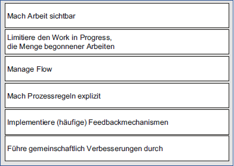

---
### Werte, Grundprinzipien, Praktiken
***

**Werte:**

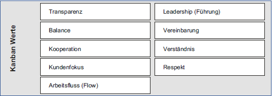

**Grundprinzipien:**

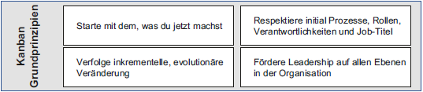

---
class: center, middle

## Transparenz (Wert) 
**&**
## "Macht Arbeit sichtbar" (Praktik)

---
class: center, middle

## Balance (Wert)
**&**
## "Limitiere den Work in Progress" (Praktik)

---
class: center, middle

## Kooperation (Wert)
**&**
## "Führe gemeinschaftlich Verbesserung durch" (Praktik)

---
class: center, middle

## Kundenfokus (Wert)
**&**
## "Manage den Arbeitsfluss" (Praktik)

---
class: center, middle

## Arbeitsfluss (Wert)
**&**
## "Manage Flow im System" (Praktik)

---
class: center, middle

## Leadership (Wert)
**&**
## "Fördere Leadership auf allen Ebenen der Organisation" (Grundprinzip)

---
### Leadership - Gemeinsam besser werden
***

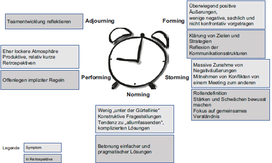

---
class: center, middle

## Verständnis (Wert)
**&**
## "Starte mit dem, was du jetzt machst" (Grundprinzip)

---
class: center, middle

## Vereinbarung (Wert)
**&**
## "Verfolge inkrementelle und evolutionäre Veränderung" (Grundprinzip)

---
class: center, middle

## Respekt (Wert)

---
class: center, middle

## [Software Projektmanagement](../../index.html)

#### Kapitel 21

# Die Gestaltung von Meetings und Workshops

Lewin Wanzek
---
### Die Gestaltung von Meetings und Workshops
***

# Rollen

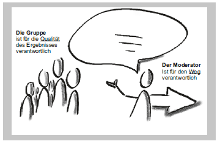

---
### Die Gestaltung von Meetings und Workshops
***

# Doppelrolle

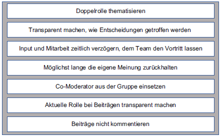

---
### Die Gestaltung von Meetings und Workshops
***

# Werkzeuge
**Pakko-Fragen:**
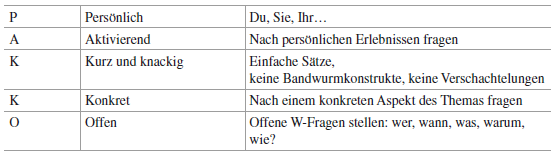

**Visualisieren:**
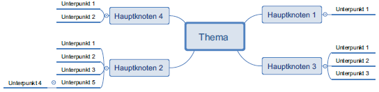

---
### Die Gestaltung von Meetings und Workshops
***

# Regeln, Tipps und praktische Hinweise

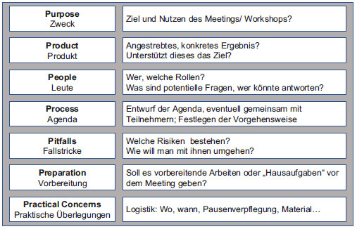
