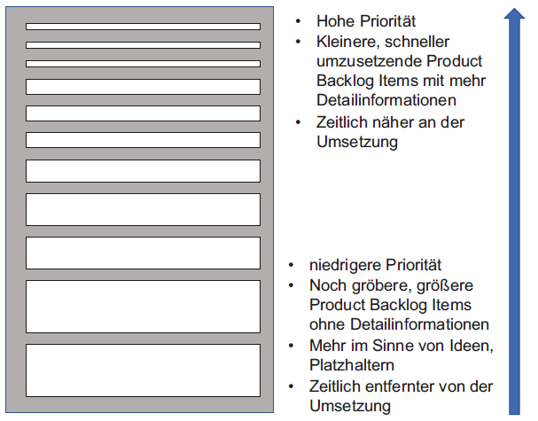
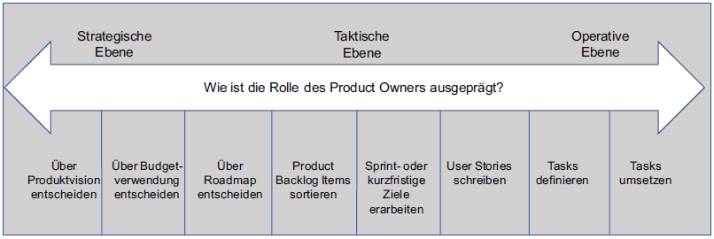
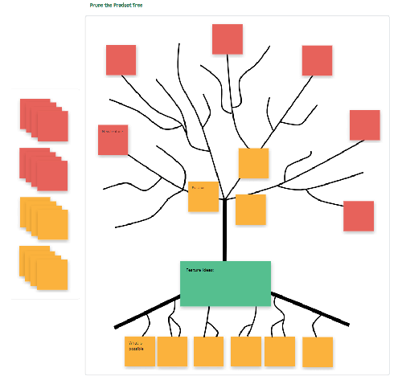
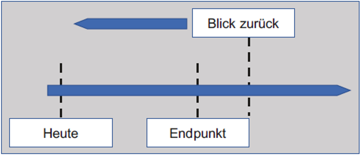
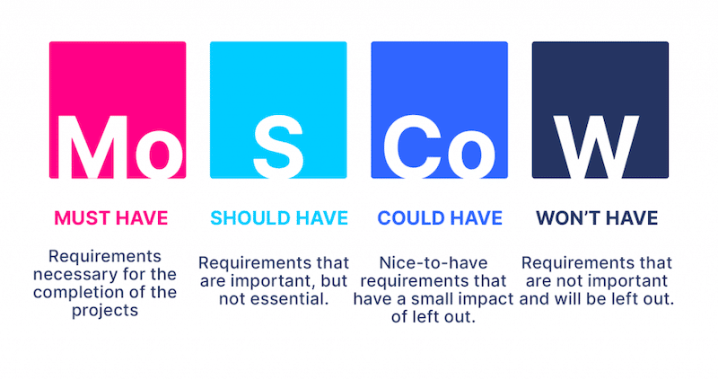
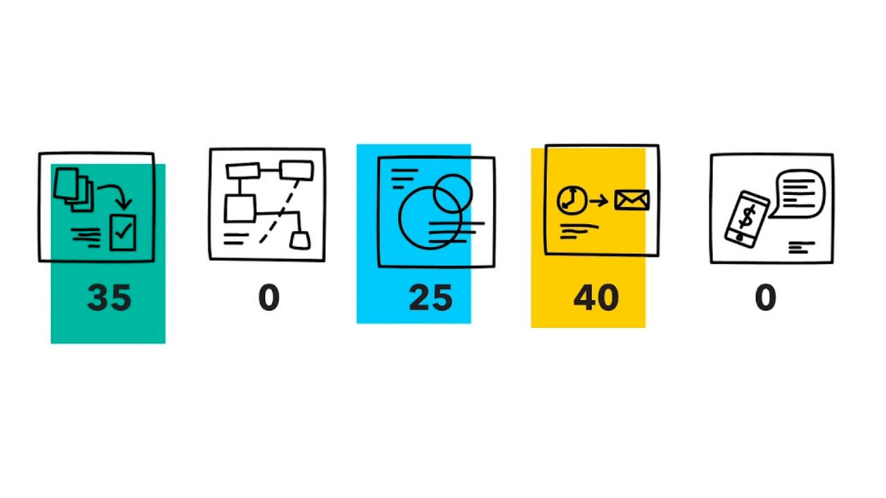

class: center, middle

## Software Projekt Management

#### Kapitel 9 - 11

# Product Backlog, befüllung und priorisierung

---
### Einführung in das Product Backlog 
***
# Product Backlog

- **Liste**

- **Aufgaben (Items)**

- **priorisierung (Hoch - Niedrig)**

- Gut, wenn: sichtbar, transparent, klar, zeigt aktuelle arbeit

--> Product Owner

---
### Einführung in das Product Backlog
***
# Priorität

---
### Einführung in das Product Backlog
***
# Das Product Backlog ist DEEP:

- **Detailed appropriately** --> Items unterschiedlich ausgearbeitet

- **Emergent** --> Backlog nicht statisch, durchgehende entwicklung

- **Estimated** --> schätzung der Items (Wert nach Umsetzung / Komplexität & Aufwand)

- **Prioritized** --> wichtig oben, unwichtig unten

---
### Einführung in das Product Backlog
***
# Product Owner

- **alleinig verantwortlich** für Product Backlog

- entscheidungen müssen respektiert werden

Aufgaben:
- Einträge **klar** formulieren
- Einträge **sortieren**
- wert der Arbeit **optimieren**

**--> Ziele sollen optimal erreicht werden**

**--> verantwortlich für erfolg des Projekts & ROI (Return on Invest)**

---
### Einführung in das Product Backlog
***
# Rollenverteilung

- Product Owner vs. Projektleiter 

- **Empfehlungen**, aber **keine festen Vorgaben**

- Kompetenzen und Verantwortungen --> Projekt Charter

---
class: center, middle 

# Das Product Backlog initial befüllen

### 1. Prune the Product Tree

### 2. Remember the Future

---
### Das Product Backlog initial befüllen
***
# Prune the Product Tree 

Ziel: Produkt in Form bringen (für den Markt "trimmen")

--> Anforderungen und To-Do´s sammeln und strukturieren

---
### Das Product Backlog initial befüllen
***
# Remember the Future

- Rückblick als wär das Projekt schon fertig

- "was war damals das Erfolgsgeheimnis?"

- zusammen mit Stakeholdern und Kunden

---
class: center, middle

# Priorisieren - Was ist wie wichtig?

### 1. wichtige Aspekte zur Beeinflussung

### 2. Tools zur Priorisierung

---
### Priorisieren - Was ist wie wichtig?
***
# wichtige Aspekte zur Beeinflussung

- Geschäftswert

- Risiko (verbunden mit der Anforderung)

- bedeutung aus Kundensicht (Kundennutzen)

- Cost of Delay

- Einfluss von Aufwand/Komplexität und Kosten

- fortlaufende Pflege-/Wartungskosten
---
### Priorisieren - Was ist wie wichtig?
***
# Risiko und Wert

---
### Priorisieren - Was ist wie wichtig?
***
# Cost of Delay

### "Was kostet es, wenn wir die Anforderung erst zu einem späteren Zeitpunkt Umsetzen?"

---
### Priorisieren - Was ist wie wichtig?
***
# Aufwand und Komplexität 

**Aufwand:** geschätzt in Personentagen oder Stunden

--> kann je nach Person und Kenntnissen Variieren

**Komplexität:** Schwierigkeit und Menge der Aufgaben

--> immer gleich

---
### Priorisieren - Was ist wie wichtig?
***
# Wann findet die Priorisierung statt?

nicht nur am Anfang:
- bei neuen Erkenntnissen oder Erfahrungen

- zur berücksichtigung von Feedback oder Wünschen der Stakeholder

- neue Product Backlog Items

---
### Priorisieren - Was ist wie wichtig?
***
# Tools zur Priorisierung

1. Priorisieren nach Einschätzen der Komplexität

2. Priorisieren nach Einschätzung des Wertes
   - Einfaches Priorisieren

   - Abstufung durch MuSCoW

   - Priorisierung nach Wert oder Attraktivität für Kunden
     
3. Kombinierte betrachtung
---
### Priorisieren nach Einschätzen der Komplexität
***
### Schätzen mit T-Shirt größen:

-unkomplizierter Überblick

---
### Priorisieren nach Einschätzung des Wertes
***
### Einfache Priorisierung 

- Priorität 1, 2, 3 (oder mehr)

- Priorität A, B, C (auch mit + oder -)

Nicht immer ideal und kann zu diskussionen führen

---
### Priorisieren nach Einschätzung des Wertes
***
### Abstufung durch MuSCoW

---
### Priorisieren - Was ist wie wichtig?
***
# Kundennutzen
- **Einschätzung am besten durch Kunden selbst**

- Monopoly Money

- 100 Points

- "Buy a Feature"

---
### Priorisieren nach Einschätzung des Wertes
***
### Monopoly Money & 100-Punkte-Methode

---
### Priorisieren nach Einschätzung des Wertes
***
### „Buy a Feature“

---
### Priorisieren nach Einschätzung des Wertes
***
### Planning Poker mit Business Value Points

---
### Kombinierte Betrachtung von Komplexität und Wert
***
### Wall Estimation

---
# Quellen 

[1]: Prune the Product tree Bild, https://huddleiq.com/help-en/research-design-templates/, letzter Zugriff 22.10.2023

[2]: MuSCoW Bild, https://storiesonboard.com/blog/moscow-prioritization-model, letzter Zugriff 23.10.2023

[3]: 100-Points Methode Bild, https://www.maxzosim.com/content/images/2022/12/The-100-Point-Method-prioritization-logo.jpeg, letzter Zugriff 23.10.2023

[4]: Planning Poker Karten Bild, https://www.easyagile.com/blog/planning-poker/, letzter Zugriff 23.10.2023
