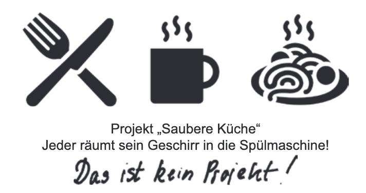
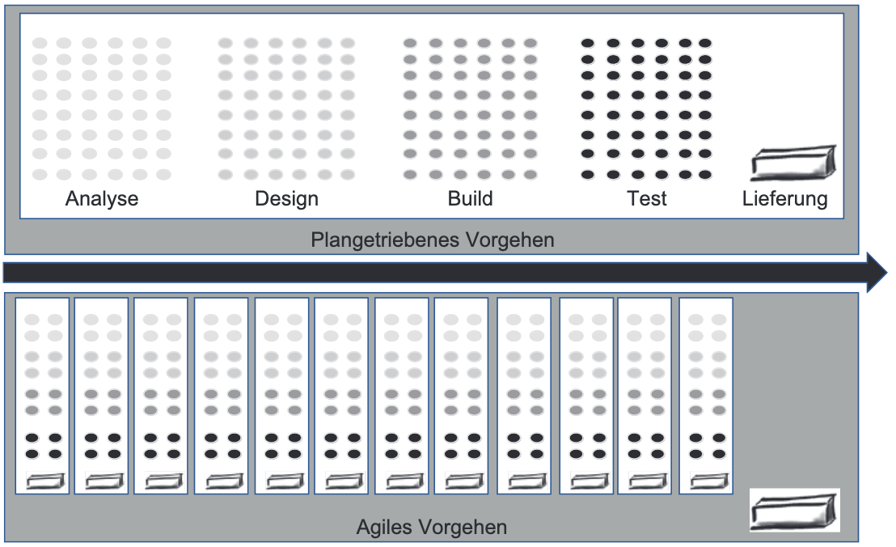
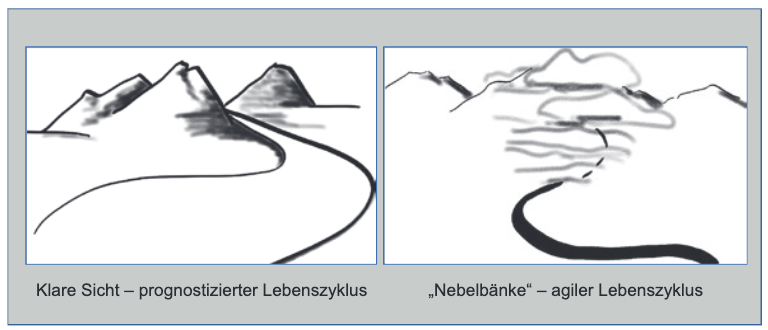

class: center, middle

## [Software Projektmanagement](../../praesentationen.html)

#### Kapitel 1

# Einleitung

Max Mustermann

---
### Inhalt
***

* Begriffsklärungen Projektmanagement
* Themengruppen Projektmanagement
* Projektlebenszyklus
* Klassisches (Plangetriebenes) Projektmanagement
* Agiles Projektmanagement

---
### Begriffsklärungen
***

**Projekt:**
* zeitlich begrenztes Vorhaben (definierter Anfang und Ende)
* Erzeugung eines einmaligen Ergebnisses
* ist kein Prozess mit definierten Auslöser und Ergebnis

**Projektmanagement:**
* umfasst Führungsaufgaben, -organisation, -techniken, -mittel zur erfolgreichen Abwicklung eines Projektes

---
### Begriffsklärungen
***

**"Klassisches" Projektmanagement:**
* monolithischer Ansatz
* ist plangetrieben
* Scope führend: 
  1. Inhalt und Umfang werden definiert
  2. Zeit und Finanzbedarf werden ermittelt

**"Agiles" Projektmanagement:**
* iterativ-inkrementeller Ansatz
* "value", also Mehrwert/Nutzen, steht im Vordergrund
* "value" führend:
  1. Zeit und Budget werden festgelegt
  2. Inhalt und Umfang werden ermittelt
* Scrum und Kanban wichtige Vertreter

---
### Begriffsklärungen
***

**Projektmanager/Projektleiter:**
* mit der Führung des Teams betraute Person
* für Erreichung der Ziele des Projektes verantwortlich
* Aufgaben:
  * Mitgliedschaft und Rollen unter Führung des Projektleiters
  * Verantwortung für das Team und das Ergebnis
  * Wissen und Fähigkeiten

---

### Themengruppen Projektmanagement
***

**Themengruppen:** Themenbereiche, die spezifisches Wissen erfordern und durch Prozesse, Ergebnisse sowie verwendete Werkzeuge und Methoden charakterisiert werden

**Themengruppen des Projektmanagements nach ISO 21500:**
* **Integration:** Vorgehensweise zur ganzheitlichen Projektintegration.
* **Stakeholder:** Betroffene und Interessenten am Projekt.
* **Scope:** Projektinhalt und -umfang.
* **Resource:** Potenzielle Teammitglieder und benötigtes Know-how.
* **Time:** Dauer der Projektabdeckung.
* **Cost:** Kosten für Projektabdeckung.
* **Risk:** Projektbezogene Risiken (Chancen und Bedrohungen).
* **Quality:** Zu beachtende Qualitätsstandards und Prüfverfahren.
* **Procurement:** Notwendige Beschaffungen für das Projekt.
* **Communication:** Kommunikationsmethoden und -rhythmus im Team.

---

### Projektlebenszyklus
***

Der Projektlebenszyklus ist die __Abfolge der Phasen__, die ein Projekt vom __Aufsetzen__ (Initiieren) bis zum __Abschluss__ durchläuft.

* Erarbeitung des Projektergebnisses läuft in Phasen ab
* Phasen je nach Branche oder Umfeld unterschiedlich
* Allgemeine Ausdrücke für Phasen:
    * Analyse
    * Design
    * Herstellung/Umsetzung
    * Test
    * Lieferung

* __Iteration:__ die in Schleifen erfolgende Ausarbeitung eines Ergebnisses 
* __Inkrement:__ ein Ergebnis, das immer weiter ergänzt wird

---

### Projektlebenszyklus
***

**Phasenmodelle:**
* Project Management Institute beschreibt vier verschiedene Phasenmodelle:
    * Predictive life cylce ("klassischer" Ansatz)
    * Iterativer Lebenszyklus
    * Inkrementeller Lebenszyklus
    * Agiler Lebenszyklus (inkrementell und iterativ)

---

### Projektlebenszyklus
***

**Vorgehensweisen:**
* __Plangetriebenes Vorgehen:__ größere Iterationen, mit einer Lieferung ganz am Ende
* __Agiles Vorgehen:__ kleine Iterationen, mit jeweils kleineren Ergebnissen

---

### Projektlebenszyklus
***

**Anwendung der Lebenszyklen:**

* **Plangetriebenes Vorgehen:**
  * Ergebnis genau spezifiziert
  * Erfahrung mit ähnlichen Projekten
  * wenige Änderungen
  * Feedback weniger relevant
  * weniger komplexe Sachverhalte
  * ohne Zwischenlieferungen

* **Agiles Vorgehen:**
  * Anforderungen nicht klar
  * keine Erfahrung mit ähnlichen Projekten
  * komplexe Sachverhalte
  * Feedback und Lernen zentral
  * Änderungen basierend auf dem Feedback
  * Zwischenlieferungen

---

### Projektlebenszyklus
***

**Anwendung der Lebenszyklen:**

---

### Klassisches (Plangetriebenes) Projektmanagement
***

**Schritte der klassichen Planung eines Projektes:**
* Projektteam zusammenstellen
* Scope definieren
  * Inhalt, Umfang
* benötigte Ressourcen schätzen
  * Time, Cost 
* Planung in weiteren Themengruppen
* Projektmanagementplan
* Projektplan
  * Baselines
* Change Requests
  * spätere Änderungen der Planung

---

### Agiles Projektmanagement
***

**Begriffe:**
* Inkrement: Ergebnis, das immer weiter ergänzt wird.
* Product Backlog: Liste der anstehenden Arbeiten
* Review: Kritische Besprechung mit Festlegung der nächsten Aufgaben
* Retrospektive: wichtiges Meeting, bei dem Zusammenarbeit im Team, seine Prozesse usw. diskutiert werden
* Stakeholder: tatsächlich Betroffene von oder Beteiligte an Projekten
* Task Board/Kanban Board: Whiteboard oder Pinnwand mit vertikalen Spalten, auf der Arbeit und Fortschritt dargestellt wird